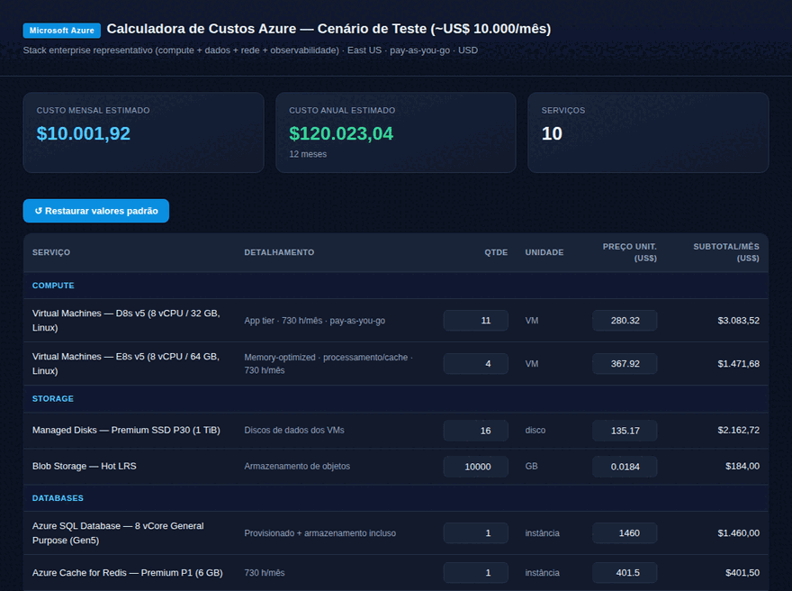

# aws-pricing-automation

Automação para gerar **estimativas de custo de nuvem reais e compartilháveis** a partir de uma especificação de serviços — sem depender de trabalho manual repetitivo no console dos provedores.

Dois módulos:

| Módulo | Provedor | Entrega |
|---|---|---|
| **`aws/`** | AWS | Dirige o [AWS Pricing Calculator](https://calculator.aws) via Playwright headless, monta a estimativa, ajusta os serviços até bater um alvo de custo e gera o **link oficial anônimo** (`https://calculator.aws/#/estimate?id=...`). |
| **`azure/`** | Azure | Gera uma **calculadora HTML interativa e auto-hospedável** a partir de um spec JSON (quantidades e preços editáveis, total mensal/anual ao vivo). Vira um link de verdade ao hospedar (GitHub Pages/Netlify), sem exigir login Microsoft. |

## Demonstração

Calculadora Azure interativa gerada a partir de um spec JSON — quantidades e preços editáveis, com o total mensal/anual recalculado ao vivo:



---

## Por que existe

O link genérico do calculador oficial não reflete o dimensionamento real de uma proposta. Este projeto transforma uma **lista de serviços + volumes** em uma estimativa concreta e compartilhável:

- **AWS** — é possível gerar o link oficial anônimo de forma programática. O pipeline abre o calculador, configura cada serviço, valida o custo por serviço e clica em *Share* aceitando os termos para extrair a URL pública.
- **Azure** — o calculador oficial **exige login Microsoft** para *Share/Save* (só *Export/Excel* é anônimo). Por isso a entrega Azure é um HTML sob seu controle, com a mesma proposta de valor: um link interativo que o cliente pode ajustar.

---

## AWS — pipeline Playwright

`aws/build_estimate_example.mjs` demonstra o fluxo completo de **editar uma estimativa existente** e escaloná-la até um alvo de custo:

1. Abre uma estimativa pública read-only e clica **"Atualizar estimativa"** → gera uma cópia editável (mantida no `localStorage` do SPA — tudo precisa acontecer em **uma única sessão** do browser).
2. Abre o editor de cada serviço (ícone de lápis por linha) e ajusta os campos de maior alavancagem.
3. Usa o **Amazon Athena como "dial" de fechamento**: lê o total real acumulado após os demais serviços e calcula o `GB verificado por consulta` exato para cravar o alvo — assim qualquer imprecisão nas outras estimativas é absorvida.
4. Renomeia a estimativa e gera o **link compartilhável** via *Share → Concordar e continuar*.

### Helpers reutilizáveis

O calculador re-renderiza campos de forma agressiva; os helpers abaixo tornam a automação confiável:

- `fillVerify(aria, val)` — preenche e **relê** o `inputValue` (campos numéricos re-renderizam; confirmar é obrigatório).
- `readSettled()` — espera o *Total Monthly cost* **estabilizar** antes de ler/salvar.
- `openEdit(ariaRe)` — abre o form de edição de um serviço com **retry** (o SPA às vezes cai em `/addService` por corrida de re-render).
- `saveEdit()` — o botão de salvar no form de edição é **"Atualizar"** (não "Salvar").

### Quirks já mapeados (economizam horas)

- **Botão de salvar** no form de edição é **"Atualizar"**; o de criação é *"Salvar e ver resumo"*.
- **A cópia editável só vive no `localStorage`** — feche o browser e ela some. Faça editar → renomear → compartilhar na mesma sessão.
- **Amazon Bedrock**: `requisições/min` e `horas/dia` só aceitam **inteiros**. Volume mensal = `req/min × 60 × horas/dia × 30`.
- **Não altere a região nem a rota de inferência** do Bedrock — há um bug em que a 2ª entrada Anthropic em `us-east-1` passa a cobrar o output pelo preço do input.

### Rodar

```bash
npm install          # instala o Playwright
npx playwright install chromium
node aws/build_estimate_example.mjs
```

Ajuste `SRC` (estimativa base), `NAME`, `TARGET` e os valores de cada `editService()` conforme o cenário.

---

## Azure — gerador de HTML

```bash
node azure/gen_azure_html.mjs azure/example.spec.json saida.html
node azure/verify_azure_html.mjs saida.html      # validação
```

O spec é um JSON simples:

```json
{
  "titulo": "Calculadora de Custos Azure",
  "subtitulo": "Stack enterprise · East US · pay-as-you-go",
  "regiao": "East US",
  "servicos": [
    { "categoria": "COMPUTE", "servico": "Virtual Machines — D8s v5",
      "detalhe": "8 vCPU / 32 GB · 730 h/mês", "qtd": 3, "unidade": "VM", "preco": 280.32 }
  ]
}
```

Os `servicos` são agrupados por `categoria` na ordem do array. Veja `azure/example.spec.json` → `azure/example.output.html` (cenário enterprise de referência, ~US$ 10.000/mês).

---

## Estrutura

```
aws/build_estimate_example.mjs   # pipeline Playwright (editar estimativa → alvo → link)
azure/gen_azure_html.mjs         # gerador spec JSON → HTML interativo
azure/verify_azure_html.mjs      # validador do HTML gerado
azure/example.spec.json          # spec de exemplo (sintético)
azure/example.output.html        # HTML gerado de exemplo
assets/demo.gif                  # demonstração
```

## Aviso

Repositório contém apenas o **tooling** e **exemplos sintéticos**. Nenhum dado comercial, proposta ou informação de cliente está incluído.

## Licença

[MIT](LICENSE)
